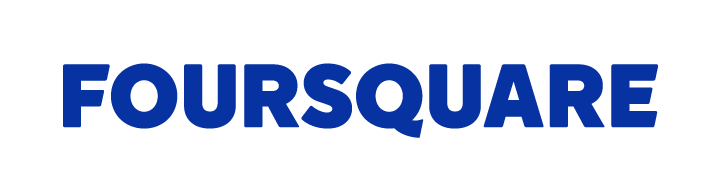

Together, we call on the **FCC** to create an open, public process to inform its evaluation of **zero rating plans.**
: * [Companies](#companies)
  * [Investors](#investors)
  * [Civil society](#groups)

  [_Read the letter_](#letter)

---

# ♥ {#companies}

Companies
: * 
  * 
  * 
  * 
  * 
  * 
  * 
  * 

---

# ♥ {#investors}

Investors
: * 
  * 
  * 
  * 
  * 
  * 
  * 
  * 

---

# ♥ {#groups}

Civil Society
: * 
  * 
  * 
  * 
  * 
  * 
  * 
  * 

---

# ♥ {letter}

The letter
: [**Download the PDF**](/letter.pdf)
  <!-- PLEASE KEEP THE TABS AND SPACING CONSISTENT HERE (OR ELSE) -->
  

  

    Federal Communications Commission 
    445 12th Street, SW 
    Washington D.C. 20554
  

  

    May X, 2016
  

  

    Dear Chairman Wheeler and Commissioners Clyburn, Rosenworcel, Pai, and O’Rielly:
  

  

    We write to request an open, public process to inform your evaluation of zero-rating practices.
  

  

    Last year, under your leadership, the Federal Communications Commission (FCC) voted to defend the free and open Internet with <a href="https://www.fcc.gov/general/open-internet">strong net neutrality rules</a>. That decision was widely praised by startups, investors, academics, racial justice advocates, technologists, and public interest groups.
  

  

    The process had input from an unprecedented range of stakeholders. Hundreds of companies filed comments or made their positions known. Startup CEOs came to testify to the FCC. Civil rights leaders were vocal in their support, both in D.C. and online, connecting net neutrality to the freedom of communities of color to organize. The proceedings made national television and the front pages of some of the most visited websites in the world. Nearly 4 million individuals made their voices heard in comments to the FCC—on all sides of the debate.
  

  

    Now the FCC is evaluating how to apply these net neutrality rules to zero-rating plans—plans that exempt applications from users’ monthly data caps or data charges—that Comcast, AT&T, Verizon and T-Mobile have each introduced.
  

  

    In the Open Internet Order, the FCC declined to issue a bright-line rule against zero-rating, noting a lack of consensus on the issue in the record. However, in the time since the Order was released, ISPs have created a broad enough set of test cases that a decision on each of them would have much the same effect as a new rule, only without the same public participation and transparency. Making decisions on these cases would set precedents for future practices, and would have implications for the Internet ecosystem that reach far beyond the stakeholders directly affected by these individual plans.
  

  

    These decisions are too important to happen behind closed doors.
  

  

    Zero-rating profoundly affects Internet users' choices. Giving ISPs the power to favor some sites or services over others would let ISPs pick winners and losers online—precisely what the Open Internet rules exist to prevent. Because mobile networks are <a href="http://www.smartinsights.com/mobile-marketing/mobile-marketing-analytics/mobile-marketing-statistics/">increasingly</a> the way most Americans get online, mobile ISPs matter equally, and polls show <a href="http://thehill.com/policy/technology/230226-poll-voters-support-broad-concept-of-net-neutrality">more than 80 percent of voters</a>, from liberals to conservatives, are concerned about ISPs having the ability to pick and choose content.
  

  

    Given how many stakeholders participated in the process to make these rules, including nearly 4 million members of the public, it would be unacceptable not to seek and incorporate broad input and expertise at this critical stage.
  

  

    For these reasons, we urge you to open a public process to inform your evaluation of existing zero-rating plans. The FCC’s process in this critical area would be immeasurably enriched by the participation of diverse stakeholders, many of whose input helped shape the Open Internet rules. Together, we stand ready to contribute to your careful evaluation of this important issue, to protect an open Internet where innovation, competition and civil rights can thrive.
  

  

---

Press Contact: [press@fightforthefuture.org](mailto:press@fightforthefuture.org) / [+1 508 474 5248](tel://15084745248)
